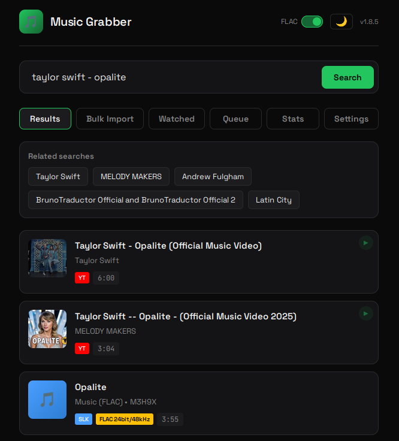
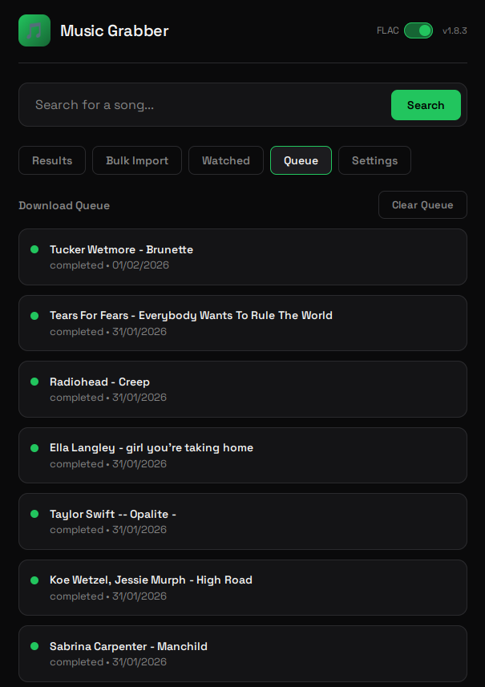
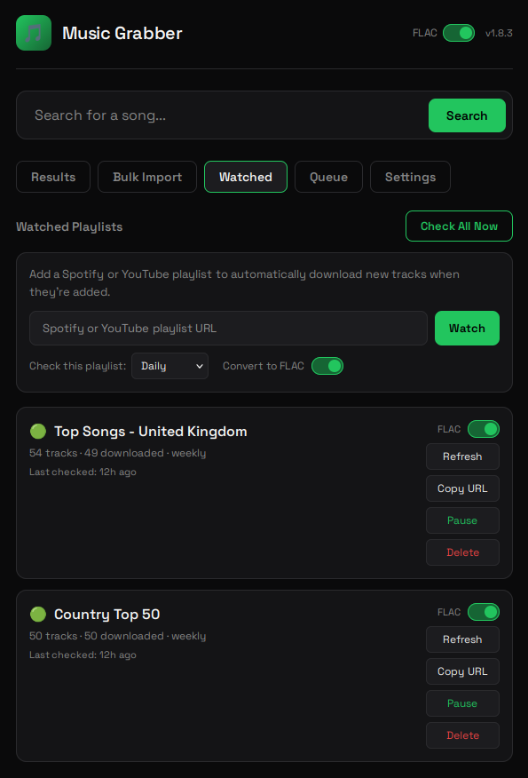
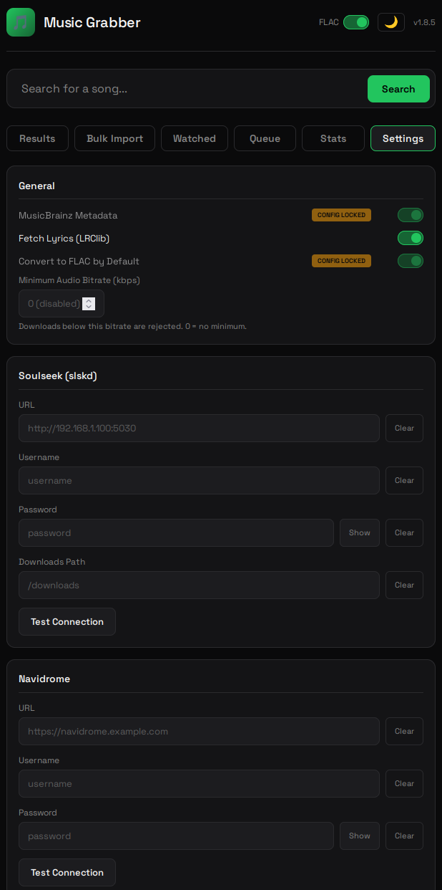
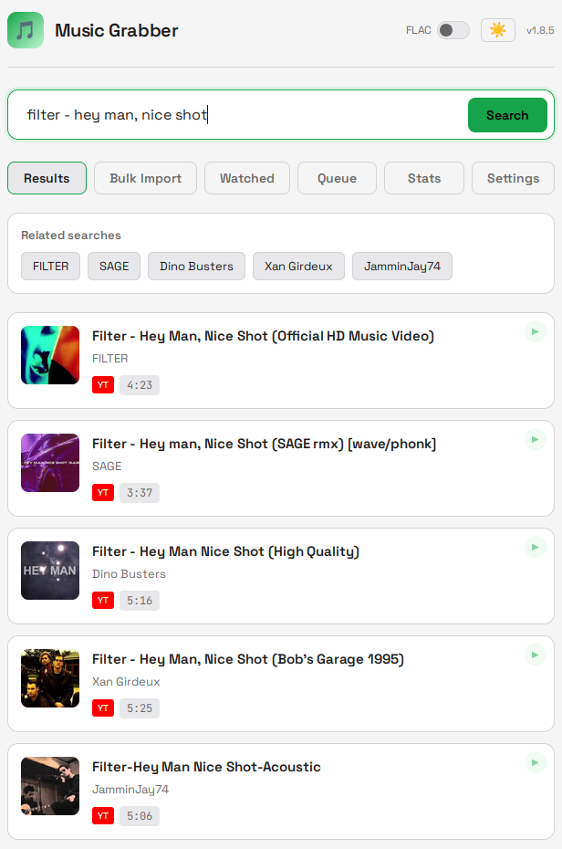

# MusicGrabber 🎵

**Версия 2.0.4**

Самостоятельный сервис для загрузки музыки. Поиск на YouTube, SoundCloud и Monochrome (Tidal lossless) — нажмите на результат и аудио наилучшего качества загрузится как FLAC прямо в вашу музыкальную библиотеку.

## Почему MusicGrabber?

Lidarr отлично подходит для альбомов, но загрузка одного трека, который вы услышали по радио, не должна требовать навигации по меню или загрузки всего дискографии исполнителя. Это сервис для случая "хочу одну песню, а не обязательство".

## Возможности

**Новое в v2.0.0:**
- **Поиск Monochrome/Tidal lossless** — полнотекстовый поиск через Monochrome API. Возвращает настоящие lossless FLAC с правильными метаданными исполнителя, альбома, обложки и качества. Результаты показывают значки "Lossless" или "Hi-Res" и ранжируются выше YouTube при доступности
- **Прямая загрузка FLAC** — загрузки Monochrome обходят yt-dlp entirely. FLAC-потоки поступают напрямую из Tidal CDN со встроенной обложкой и точными метаданными из каталога Tidal
- **"Все источники" — поиск по умолчанию** — поиск по YouTube, SoundCloud и Monochrome параллельно. Результаты lossless Monochrome всплывают наверх; YouTube и SoundCloud заполняют пробелы для треков, отсутствующих на Tidal
- **Предпросмотр Monochrome** — hover-to-preview работает для треков Monochrome с использованием AAC-потоков (родной для браузера, без yt-dlp)
- **Настраиваемый экземпляр Monochrome** — переменная окружения `MONOCHROME_API_URL` позволяет指向 на зеркальные экземпляры сообщества

**Остальные возможности:**
- **Мобильный интерфейс** — оптимизирован для быстрых поисков с телефона
- **Тёмная/светлая тема** — переключение тем кнопкой луна/солнце; предпочтение сохраняется в браузере
- **Вкладка настроек** — настройка всех интеграций через UI (редактирование docker-compose не требуется)
- **Опциональная аутентификация API** — защита экземпляра API-ключом
- **Hover для предпросмотра** — на рабочем столе наведите на результат на 2 секунды для прослушивания (работает для YouTube, SoundCloud и Monochrome)
- **Мulti-source поиск** — YouTube, SoundCloud и Monochrome (Tidal lossless) с параллельным поиском и ранжированием по качеству
- **Интеграция Soulseek** — дополнительная поддержка slskd для источников более высокого качества (FLAC из P2P)
- **Поддержка плейлистов** — загрузка целых плейлистов с автоматической генерацией M3U
- **Наблюдаемые плейлисты** — мониторинг Spotify/YouTube-плейлистов и авто-загрузка новых треков; поиск по всем источникам и загрузка лучшего качества
- **Массовый импорт** — вставьте или загрузите текстовый файл с песнями для авто-поиска и очереди; поиск по YouTube, SoundCloud и Monochrome параллельно, выбор лучшего результата
- **Лучшее качество FLAC** — извлечение самой высокой доступной audио-качества
- **Принудение минимального битрейта** — опциональное отклонение загрузок ниже настраиваемого порога битрейта
- **Отображение аудио качества** — завершённые загрузки показывают кодек и битрейт в деталях очереди с честным отчётом о lossy-to-FLAC конверсиях
- **Расширенные метаданные** — аудио-фингерпринтинг AcoustID с поисками MusicBrainz, fallback на встроенные/угаданные теги
- **Синхронизированные тексты** — автоматическая загрузка текстов из LRClib, сохраняется как `.lrc` файлы
- **Авто-организация** — создаёт структуру `Singles/Artist/Title.flac` (или плоский `Singles/Title.flac` при выключенном "Organise by Artist")
- **Обнаружение дубликатов** — пропускает уже загруженные треки
- **Очередь заданий** — отслеживание прогресса загрузки, повтор неудачных заданий, перезагрузка или удаление файлов из очереди, просмотр метаданных provenance (`Metadata:` показывает фингерпринт AcoustID, текстовое совпадение MusicBrainz или source guessed)
- **Панель статистики** — количество загрузок,成功率, дневной график, топ исполнителей, аналитика поиска
- **Webhook уведомления** — уведомления через Telegram, email или generic webhook о событиях загрузки
- **Поддержка YouTube cookies** — загрузка браузерных cookies в настройках для обхода YouTube bot detection
- **Опциональная интеграция Navidrome/Jellyfin** — авто-запуск rescan библиотеки после загрузок

## Скриншоты

| Поиск и результаты | Массовый импорт | Очередь |
|:---:|:---:|:---:|
|  |  |  |

| Наблюдаемые плейлисты | Настройки | Тёмная и светлая тема |
|:---:|:---:|:---:|
|  |  |  |

## Быстрый старт

### Вариант A: Использование Docker Hub (рекомендуется)

1. **Создайте docker-compose.yml**
   ```yaml
   services:
     music-grabber:
       image: g33kphr33k/musicgrabber:latest
       container_name: music-grabber
       restart: unless-stopped
       # Требуется для Spotify-плейлистов более 100 треков (headless browser)
       shm_size: '2gb'
       ports:
         - "38274:8080"
       volumes:
         - /путь/к/вашей/музыке:/music
         - ./data:/data
       environment:
         - MUSIC_DIR=/music
         - DB_PATH=/data/music_grabber.db
         - ENABLE_MUSICBRAINZ=true
         - DEFAULT_CONVERT_TO_FLAC=true
         # Опционально: запуск как конкретный пользователь (как *arr стек)
         # - PUID=1000
         # - PGID=1000
         # Опционально: Navidrome auto-rescan
         # - NAVIDROME_URL=http://navidrome:4533
         # - NAVIDROME_USER=admin
         # - NAVIDROME_PASS=yourpassword
         # Опционально: Jellyfin auto-rescan
         # - JELLYFIN_URL=http://jellyfin:8096
         # - JELLYFIN_API_KEY=your-jellyfin-api-key
         # Опционально: Уведомления
         # - NOTIFY_ON=playlists,bulk,errors
         # - TELEGRAM_WEBHOOK_URL=https://api.telegram.org/bot{token}/sendMessage?chat_id={chat_id}
         # - WEBHOOK_URL=https://your-webhook-endpoint.com/hook
         # - SMTP_HOST=smtp.example.com
         # - SMTP_PORT=587
         # - SMTP_USER=user@example.com
         # - SMTP_PASS=password
         # - SMTP_TO=you@example.com
   ```

2. **Запустите**
   ```bash
   docker compose up -d
   ```

3. **Откройте UI** по адресу `http://ваш-сервер:38274`

### Вариант B: Сборка из исходников

1. **Клонируйте и настройте**
   ```bash
   git clone https://github.com/dbv111m/musicgrabber.git
   cd musicgrabber
   ```

2. **Отредактируйте docker-compose.yml**

   Обновите путь к volume музыки и, опционально, добавьте учётные данные Navidrome:
   ```yaml
   volumes:
     - /путь/к/вашей/музыке:/music  # <-- ваш музыкальный каталог
     - ./data:/data                # <-- сохранение базы заданий
   ```

3. **Соберите и запустите**
   ```bash
   docker compose up -d --build
   ```

4. **Откройте UI** по адресу `http://ваш-сервер:38274`

## Конфигурация

### Вкладка настроек (рекомендуется)

Самый простой способ настроить MusicGrabber — через **вкладку Settings** в UI. Можно настроить:

- **Общее**: метаданные MusicBrainz, загрузка текстов, конвертация FLAC по умолчанию, минимальный битрейт аудио, организация по исполнителям
- **Soulseek (slskd)**: URL, учётные данные, путь к загрузкам
- **Navidrome**: URL и учётные данные для обновления библиотеки
- **Jellyfin**: URL и API-ключ для обновления библиотеки
- **Уведомления**: Telegram webhook, generic webhook URL, настройки SMTP
- **YouTube**: загрузка браузерных cookies для аутентифицированных загрузок
- **Чёрный список**: просмотр и управление заблокированными треками и загрузчиками
- **Безопасность**: API-ключ для аутентификации

Настройки хранятся в базе данных и сохраняются при перезапусках контейнера.

**Переопределение переменными окружения:** Если значение установлено через переменную окружения, оно имеет приоритет над значением базы и отображается как "заблокированное" в UI.

### Переменные окружения

| Переменная | По умолчанию | Описание |
|------------|--------------|----------|
| `PUID` | `0` | ID пользователя для владения файлами (как *arr стек) |
| `PGID` | `0` | ID группы для владения файлами (как *arr стек) |
| `MUSIC_DIR` | `/music` | Корневой каталог музыкальной библиотеки внутри контейнера |
| `DB_PATH` | `/data/music_grabber.db` | Путь к базе данных SQLite |
| `ENABLE_MUSICBRAINZ` | `true` | Включить поиск метаданных MusicBrainz |
| `ENABLE_LYRICS` | `true` | Включить автоматическую загрузку текстов из LRClib |
| `DEFAULT_CONVERT_TO_FLAC` | `true` | Конвертировать загрузки в FLAC по умолчанию (можно переключить для каждой загрузки в UI) |
| `MIN_AUDIO_BITRATE` | `0` | Минимальный аудио битрейт в kbps. Загрузки ниже отклоняются. 0 = отключено. Lossless (FLAC) всегда проходит |
| `ORGANISE_BY_ARTIST` | `true` | Создавать подпапки исполнителей под Singles. Установите `false` для плоского каталога |
| `WEBHOOK_URL` | - | Generic webhook URL — получает JSON POST при завершении/ошибке загрузки |
| `MONOCHROME_API_URL` | `https://api.monochrome.tf` | URL Monochrome API — переопределите для использования зеркальных экземпляров сообщества |
| `NAVIDROME_URL` | - | URL сервера Navidrome (например, `http://navidrome:4533`) |
| `NAVIDROME_USER` | - | Имя пользователя Navidrome для API |
| `NAVIDROME_PASS` | - | Пароль Navidrome для API |
| `JELLYFIN_URL` | - | URL сервера Jellyfin (например, `http://jellyfin:8096`) |
| `JELLYFIN_API_KEY` | - | API-ключ Jellyfin для обновления библиотеки |
| `SLSKD_URL` | - | URL API slskd (например, `http://slskd:5030`) |
| `SLSKD_USER` | - | Имя пользователя slskd |
| `SLSKD_PASS` | - | Пароль slskd |
| `SLSKD_DOWNLOADS_PATH` | - | Путь где доступны загрузки slskd (требуется для загрузок Soulseek) |
| `WATCHED_PLAYLIST_CHECK_HOURS` | `24` | Как часто проверять наблюдаемые плейлисты (в часах): 24=ежедневно, 168=еженедельно, 720=ежемесячно, 0=отключено |
| `NOTIFY_ON` | `playlists,bulk,errors` | Триггеры уведомлений (применяется ко всем каналам): `singles`, `playlists`, `bulk`, `errors` |
| `TELEGRAM_WEBHOOK_URL` | - | Полный URL Telegram webhook (см. раздел уведомлений) |
| `API_KEY` | - | API-ключ для аутентификации (см. раздел безопасности) |

## Устранение проблем

**Загрузки остаются внутри контейнера / не появляются в примонтированном volume?**
- Убедитесь, что ваш volume mount совпадает с переменной окружения `MUSIC_DIR`
- По умолчанию `MUSIC_DIR=/music`, поэтому примонтируйте вашу музыкальную папку к `/music`:
  ```yaml
  volumes:
    - /путь/к/вашей/музыке:/music  # Это ДОЛЖНО совпадать с MUSIC_DIR
  environment:
    - MUSIC_DIR=/music
  ```
- Проверьте внутри контейнера: `docker exec music-grabber ls -la /music/Singles/`

**Файлы создаются от root / permission denied?**
- По умолчанию контейнер работает от root (UID 0)
- Установите `PUID` и `PGID` для соответствия вашему хост-пользователю:
  ```yaml
  environment:
    - PUID=1000
    - PGID=1000
  ```
- Найдите ваш UID/GID: `id $USER`

**Загрузки fail с 403 errors?**
- YouTube bot detection может блокировать запросы
- Перейдите в Settings → YouTube и загрузите браузерные cookies (экспортируйте из браузера где вы вошли в YouTube)
- Используйте расширение экспорта cookies типа "Get cookies.txt LOCALLY" (Chrome/Firefox)
- Cookies истекают периодически — перезагрузите если загрузки снова начинают fail

**Файлы не видны в Navidrome/Jellyfin?**
- Проверьте пути volume mount
- Проверьте интервал сканирования Navidrome/Jellyfin если auto-rescan не настроен
- Запустите сканирование вручную в UI Navidrome/Jellyfin

## API эндпоинты

| Метод | Эндпоинт | Описание |
|--------|----------|----------|
| `GET` | `/` | Web UI |
| `GET` | `/api/config` | Получить конфигурацию сервера (версия, дефолты, auth_required) |
| `GET` | `/api/settings` | Получить все настройки (требует auth если установлен API key) |
| `PUT` | `/api/settings` | Обновить настройки |
| `POST` | `/api/search` | Поиск источников (`{"query": "...", "limit": 15, "source": "youtube/soundcloud/monochrome/all"}`) |
| `POST` | `/api/download` | Поставить в очередь загрузку (`{"video_id": "...", "title": "...", "source": "youtube/soundcloud/monochrome"}`) |
| `GET` | `/api/jobs` | Список недавних заданий |
| `POST` | `/api/jobs/{id}/retry` | Повторить неудачную загрузку |
| `DELETE` | `/api/jobs/{id}/file` | Удалить загруженный файл и тексты из библиотеки |

## Архитектура проекта

### Структура

```
MusicGrabber/
├── app.py                  # Основное приложение FastAPI, роуты API
├── constants.py            # Общие константы (таймауты, пути, VERSION)
├── models.py               # Pydantic модели запросов/ответов
├── db.py                   # Слой базы данных SQLite
├── settings.py             # Управление настройками (env > DB > default)
├── utils.py                # Общие утилиты (sanitisation, hash, duplicate check)
├── search.py               # Мульти-source поиск (YouTube, SoundCloud, Monochrome)
├── downloads.py            # Обработка загрузок (single, playlist, slskd)
├── metadata.py             # AcoustID fingerprinting, MusicBrainz, LRClib тексты
├── youtube.py              # YouTube-специфичная логика (cookies, 403 retry)
├── slskd.py                # Интеграция Soulseek через slskd
├── spotify.py              # Интеграция Spotify (embed endpoint)
├── spotify_browser.py      # Скрапинг Spotify больших плейлистов (Playwright)
├── amazon.py               # Скрапинг Amazon Music плейлистов (Playwright)
├── bulk_import.py          # Массовый импорт треков
├── watched_playlists.py    # Мониторинг плейлистов и авто-загрузка
├── notifications.py        # Отправка уведомлений (Telegram, email, webhook)
├── middleware.py           # Аутентификация API и rate limiting
├── Dockerfile              # Определение Docker образа
├── docker-compose.yml      # Определение Docker сервисов
├── entrypoint.sh           # Скрипт запуска контейнера
└── static/                 # Фронтенд (HTML/CSS/JS)
```

### Основные модули

**app.py** — Точка входа FastAPI приложения, определяет все API роуты:
- Базовые роуты ( served UI, config )
- Settings API (get, update, test connections)
- Statistics API (downloads, search analytics)
- Search API (multi-source, preview)
- Download API (queue singles, playlists)
- Job management API (list, retry, delete)
- Bulk import API (async processing)
- Playlist fetch API (Spotify, Amazon)
- Watched playlists API (CRUD operations)
- Blacklist API (report, manage)

**db.py** — Управление SQLite базой данных:
- Connection pooling для thread-safety
- Schema creation с миграциями
- Stale job cleanup (мониторинг зависших заданий)
- Search log retention (очистка старых логов)
- Blacklist helpers

**downloads.py** — Обработка загрузок:
- `process_download()` — single track (YouTube/SoundCloud/Monochrome)
- `process_playlist_download()` — YouTube playlists
- `process_slskd_download()` — Soulseek via slskd
- `create_bulk_playlist()` — M3U generation
- `trigger_navidrome_scan()` / `trigger_jellyfin_scan()` — library refresh
- `probe_audio_quality()` — ffprobe audio analysis

**metadata.py** — Обогащение метаданных:
- `lookup_metadata()` — AcoustID fingerprinting → MusicBrainz
- `lookup_musicbrainz()` — Text-based search fallback
- `fetch_lyrics()` — LRClib synced lyrics
- `apply_metadata_to_file()` — Tagging with mutagen (FLAC/MP3/M4A/OGG)

**search.py** — Мульти-source поиск:
- `SOURCE_REGISTRY` — Extensible source registry
- `search_source()` — Search single source
- `search_all()` — Parallel search across sources
- Quality-based result ranking

**settings.py** — Управление конфигурацией:
- Environment variable overrides
- Database persistence
- Type conversion (bool, int, string)
- Sensitive field masking

### Поток загрузки

1. **Search** — Пользователь ищет трек → API возвращает результаты из всех источников
2. **Queue** — Пользователь кликает результат → создаётся job в `jobs` таблице
3. **Download** — Background thread загружает аудио:
   - YouTube/SoundCloud: yt-dlp extract → optional FLAC conversion
   - Monochrome: Direct FLAC from Tidal CDN
   - Soulseek: slskd API download
4. **Metadata** — AcoustID fingerprint → MusicBrainz lookup → apply tags
5. **Lyrics** — Fetch from LRClib → save `.lrc` file
6. **Library Scan** — Trigger Navidrome/Jellyfin rescan (if configured)
7. **Notification** — Send Telegram/email/webhook (if configured)

## Безопасность

MusicGrabber включает **опциональную API key аутентификацию** для защиты экземпляра.

### Аутентификация API ключом

Включите API аутентификацию установкой API ключа в Settings или через переменную окружения:

```yaml
environment:
  - API_KEY=your-secret-key-here
```

Когда включено:
- Все API запросы требуют заголовок `X-API-Key`
- Фронтенд запрашивает ключ при первом посещении и сохраняет в browser localStorage
- Rate limiting: 60 запросов в минуту на IP

### Дополнительные меры безопасности

- Для внешнего доступа рассмотрите reverse proxy с дополнительной аутентификацией (Caddy, nginx, Authelia)
- API позволяет запускать загрузки и файловые операции, рассматривайте доступ как административный

## Лицензия

Do whatever you want with it. 🤷
